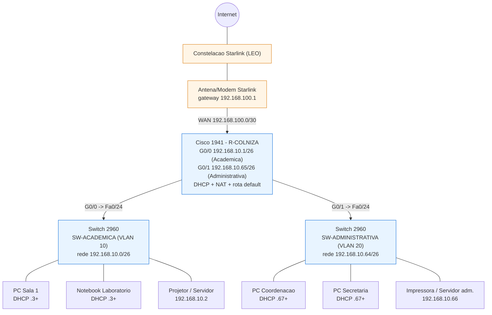

# Topologia da Rede — Escola Municipal Rural de Colniza-MT

> Disciplina: **Network Architect Solutions** — Global Solution 2026 (Stratfy)

## 1. Lista de dispositivos

| Qtd | Dispositivo | Modelo | Papel | Endereçamento |
|---|---|---|---|---|
| 1 | Roteador | **Cisco 1941** + módulo EHWIC-1GE | Gateway das duas LANs, servidor DHCP, NAT, rota default para a Internet | G0/0 `192.168.10.1/26`, G0/1 `192.168.10.65/26`, WAN G0/0/0 `192.168.100.2/30` |
| 1 | Switch | **Cisco 2960** (Acadêmica) | Acesso das salas + laboratório (VLAN 10) | SVI gerência `192.168.10.62/26` |
| 1 | Switch | **Cisco 2960** (Administrativa) | Acesso da coordenação/administração (VLAN 20) | SVI gerência `192.168.10.126/26` |
| 1 | Modem/Antena | **Starlink** (kit Standard) | Uplink de Internet via satélites LEO; NAT/CGNAT para a operadora | Gateway `192.168.100.1` |
| N | PCs / Notebooks | genéricos (PT) | Estações dos alunos e da administração | DHCP (`.3`–`.62` / `.67`–`.126`) |
| 0/1 | Servidor local (opcional) | NAS/host PT | Conteúdo educacional offline / impressora | `192.168.10.2` (acad.) / `192.168.10.66` (adm.) |

> O "servidor DHCP" **não** é um host à parte: o próprio Cisco 1941 atua como
> servidor DHCP (pools `ACADEMICA` e `ADMINISTRATIVA`).

## 2. Topologia FÍSICA

- A **antena Starlink** é instalada no ponto mais alto e desobstruído da escola
  (telhado/mastro), com visada limpa do céu — requisito do enlace LEO.
- O cabo da antena desce até o **roteador Wi-Fi/modem Starlink**, dentro da
  sala da coordenação (ambiente protegido, com no-break).
- Do modem Starlink sai um cabo de rede para a **porta WAN do Cisco 1941**
  (rede de trânsito `192.168.100.0/30`).
- Do **Cisco 1941**:
  - `G0/0` → cabo UTP → porta `Fa0/24` do **Switch 2960 Acadêmica**.
  - `G0/1` → cabo UTP → porta `Fa0/24` do **Switch 2960 Administrativa**.
- Cada **Switch 2960** distribui as portas de acesso para os PCs/notebooks da
  sua rede (salas/laboratório no acadêmico; coordenação/secretaria no
  administrativo).
- Toda a infraestrutura ativa (modem, router, switches) fica em um **rack/quadro
  com no-break (UPS)**, pois a energia no interior de Colniza é instável.

## 3. Topologia LÓGICA

- Dois domínios de broadcast separados, um por sub-rede /26:
  - **Acadêmica** `192.168.10.0/26` (VLAN 10) — gateway `192.168.10.1`.
  - **Administrativa** `192.168.10.64/26` (VLAN 20) — gateway `192.168.10.65`.
- O roteamento **entre** as duas redes é feito pelo Cisco 1941 (cada interface é
  o gateway de uma /26). Assim, um PC acadêmico só fala com um PC administrativo
  passando pelo roteador — onde, futuramente, é possível aplicar ACLs.
- O **DHCP** é centralizado no 1941; cada rede recebe IP, máscara, gateway e DNS
  do seu pool.
- A **saída para a Internet** é única (NAT/PAT no 1941 → modem Starlink), de modo
  que as duas redes compartilham o link de satélite.

## 4. Diagrama (Mermaid)

## 5. Mapa de portas (resumo para montar o .pkt)

| Origem | Porta | Destino | Porta | Cabo |
|---|---|---|---|---|
| Modem Starlink | LAN | Cisco 1941 | G0/0/0 (módulo EHWIC-1GE) | Reto (Copper Straight-Through) |
| Cisco 1941 | G0/0 | SW-ACADEMICA | Fa0/24 | Reto |
| Cisco 1941 | G0/1 | SW-ADMINISTRATIVA | Fa0/24 | Reto |
| SW-ACADEMICA | Fa0/1–0/20 | PCs/notebooks acadêmicos | NIC | Reto |
| SW-ADMINISTRATIVA | Fa0/1–0/12 | PCs administrativos | NIC | Reto |

> No Packet Tracer, a antena Starlink pode ser representada por um roteador
> genérico (ou um modem/Cloud) servindo de gateway de Internet. O foco da
> avaliação é a LAN interna (router + 2 switches + DHCP + sub-redes), que está
> 100% configurada e coerente.
